# OST Tools
This project is based on the Jetpack Compose Material Design 3.
Functions:
- Some information about the phone
- Reboot to different modes (Recovery, Fastboot, Download Mode)
- Currency converters and time calculators
- Restoring broken/burnt pixels and checking the display for their presence
- "Stargazers" - those who put a star on one of my projects
- List of applications, freezing and deleting them

Android app:
<p align="center">


</p>

WearOS app:
<p align="center">
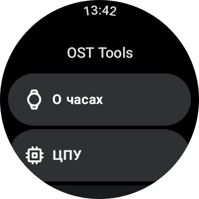
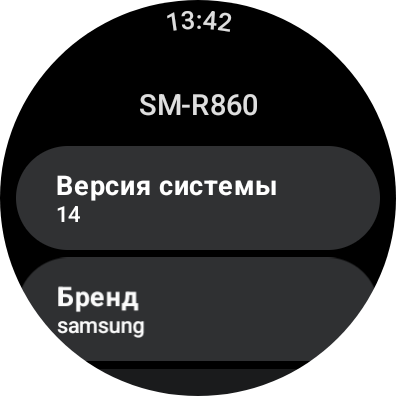
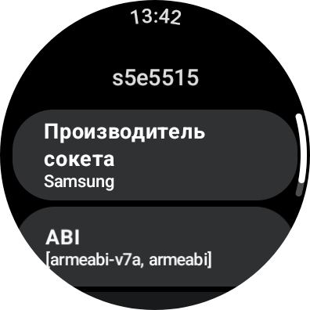
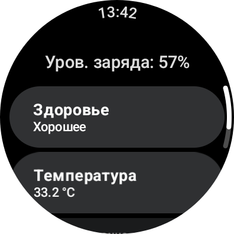
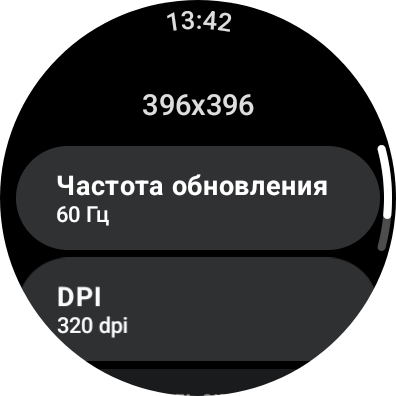
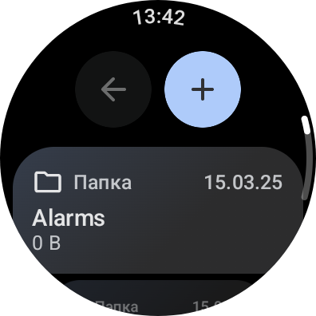
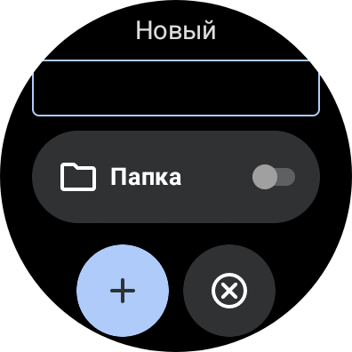
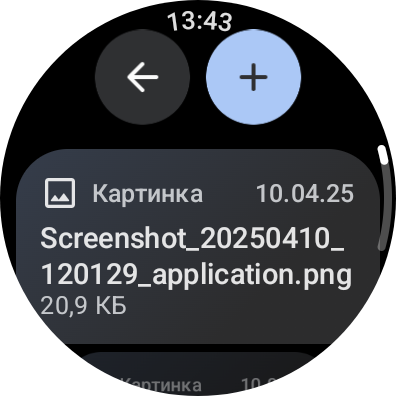
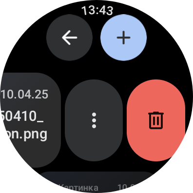
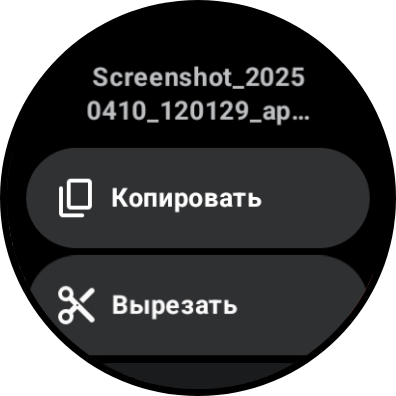
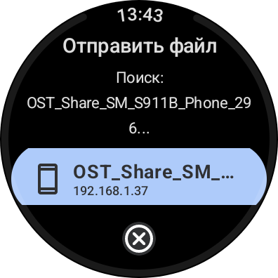
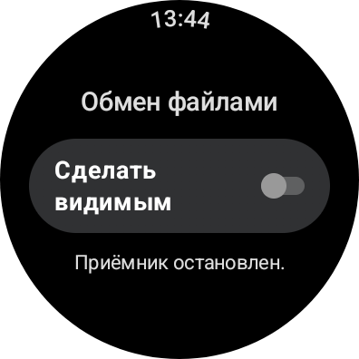
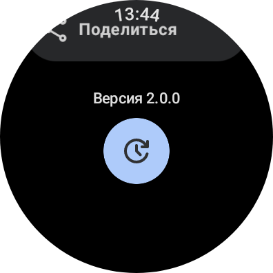
</p>

## Usage
- Get your token here - https://github.com/settings/tokens
- Put your token in local.properties:
```properties
github.token=token_here
```
- Put your repos in NetworkDataSource.kt
```kt
private suspend fun getStargazersInternal(): List<Stargazer> = withContext(Dispatchers.IO) {
    Log.d(TAG, "Starting getStargazersInternal...")
    val repoList = listOf(
        "ost-sys.github.io", // here
        "ost-program-android" // and here
    )
...
```
- Put your GitHub username
```kt
val result = service.getStargazers("your_username", repoName).map { stargazer ->
    stargazer to repoName
}
```
- How to install app on WearOS and grant permissions:
  - Pair your watch with PC using Wireless ADB ([Guildeline (XDA)](https://xdaforums.com/t/guide-how-to-connect-adb-over-wifi.3368602/))
  - Install app
  ```bash
  adb install wear-app-release.apk
  ```
  - Grant permissions
  ```bash
  adb shell
  appops set com.ost.application MANAGE_EXTERNAL_STORAGE allow
  appops set com.ost.application WRITE_EXTERNAL_STORAGE allow
  appops set com.ost.application READ_EXTERNAL_STORAGE allow
  appops set com.ost.application REQUEST_INSTALL_PACKAGES allow // for install APKs
  ```


## Translators
- [Radomyr](https://github.com/BRamil0), [Anton](https://github.com/Anton-Aboba1234), [Bohdan](https://github.com/bohdan157) - For translating to Ukrainian.
- [Luminous418](https://github.com/Luminous418) - For translating to Spanish

## Credits
- [zhh4eny](https://t.me/zh4eny) - Created a MD file.
- [Weever](https://github.com/Weever1337) - For a new API for currency converter
- [Google](https://developer.android.com/jetpack) for their Jetpack and Material Components libraries.
