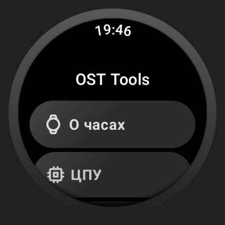
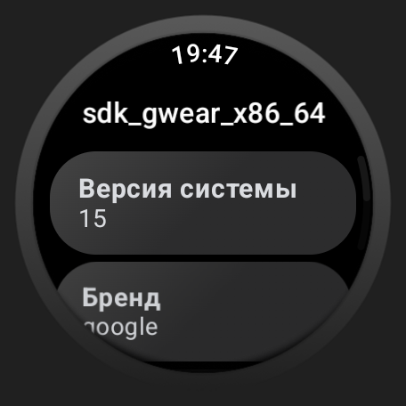
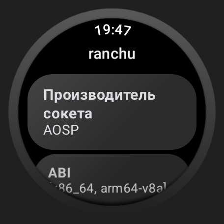
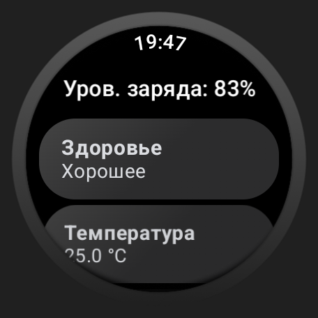
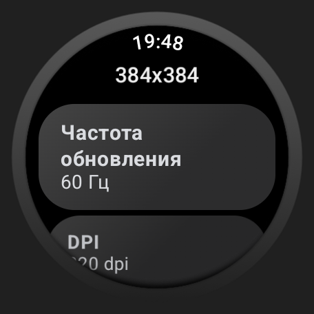

# OST Tools
This project is based on the unofficial One UI design.
Functions:
- Some information about the phone
- Reboot to different modes (Recovery, Fastboot, Download Mode)
- Currency converters and time calculators
- Restoring broken/burnt pixels and checking the display for their presence
- "Stargazers" - those who put a star on one of my projects
- List of applications, freezing and deleting them

Android app:
<p align="center">


</p>

WearOS app:
<p align="center">






</p>

## Usage
- Add the needed [SESL6 Android Jetpack Modules](https://github.com/tribalfs/sesl-androidx?tab=readme-ov-file#sesloneui-android-jetpack-unofficial)
  and [SESL6 Material Components for Android](https://github.com/tribalfs/sesl-material-components-android?tab=readme-ov-file#sesloneui-material-components-for-android-unofficial)
  dependencies to your project following their usage guide. Then add the following dependency next:

```
repositories {
  //other remote repositories
  
   maven {
      url = uri("https://maven.pkg.github.com/tribalfs/oneui-design")
      credentials {
          username = "<gh_username>"
          password = "<gh_access_token>"
      }
   } 
}
```
- Put your token here:
```kt
private val client = OkHttpClient.Builder()
    .addInterceptor { chain ->
        val request = chain.request().newBuilder()
            .addHeader("Authorization", "Bearer <token>") // here
            .build()
        chain.proceed(request)
    }
    .build()
```

## Program translators and who participated in the development
- [zhh4eny](https://t.me/zh4eny) - Created a MD file. 
- [Radomyr](https://github.com/BRamil0), [Anton](https://github.com/Anton-Aboba1234), [Bohdan](https://github.com/bohdan157) - For translate to Ukrainian.
- [Weever](https://github.com/Weever1337) - For a new API for currency converter
- [Luminous418](https://github.com/Luminous418) - For translate to Spanish

## Credits
- [Tribalfs](https://github.com/tribalfs/oneui-design)
- [Google](https://developer.android.com/jetpack) for their Jetpack and Material Components libraries.
- [Samsung](https://www.samsung.com/) for their awesome OneUI Design.
- [Yanndroid](https://github.com/Yanndroid) and [Salvo Giangreco](https://github.com/salvogiangri) who created the [OneUI4 Design library](https://github.com/OneUIProject/oneui-design) where this repository came from.
