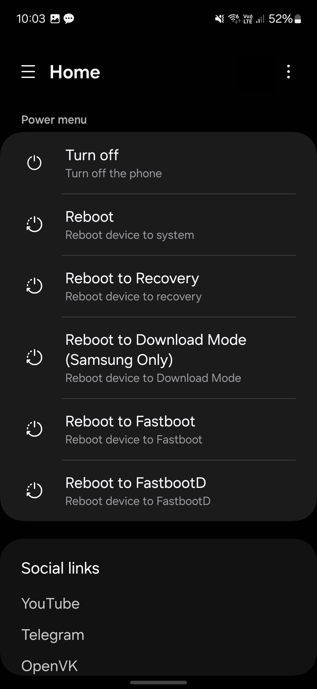
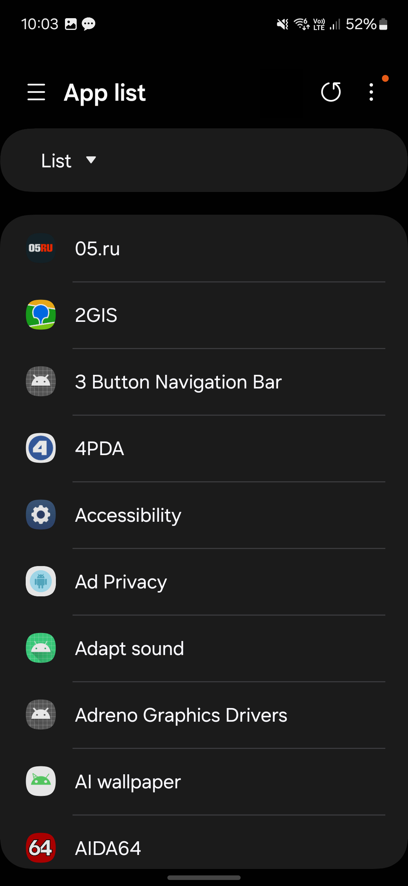
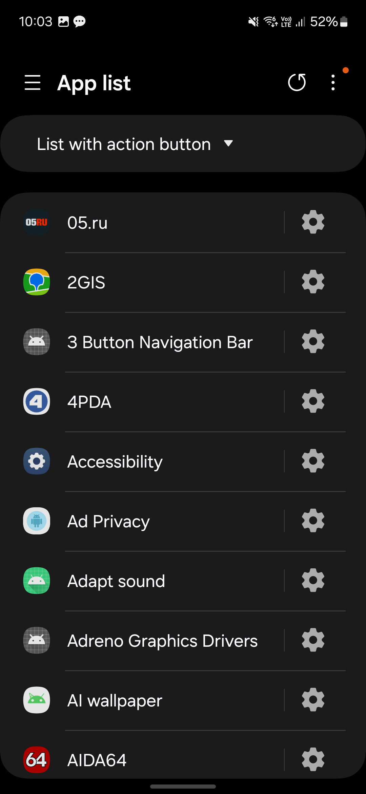
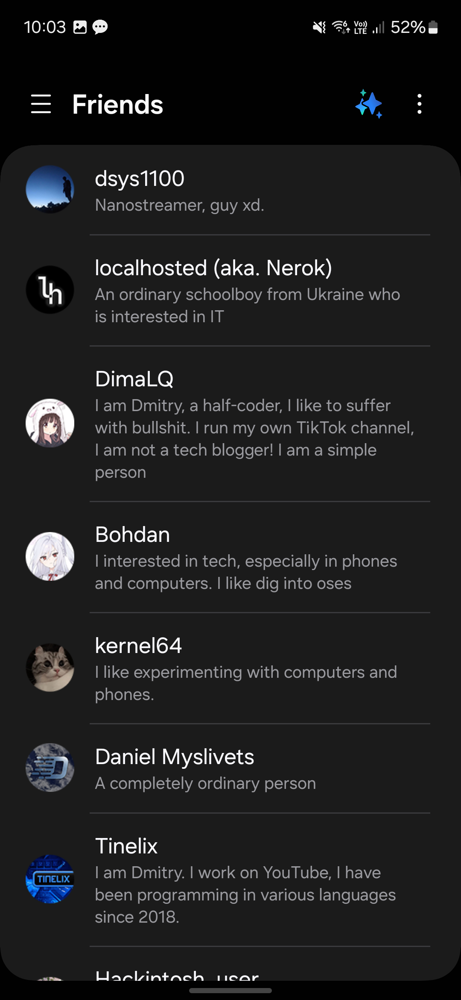
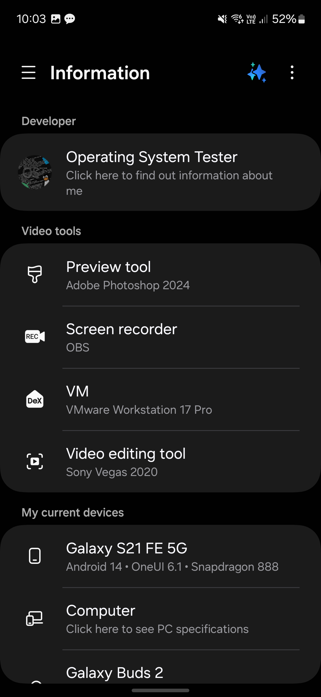
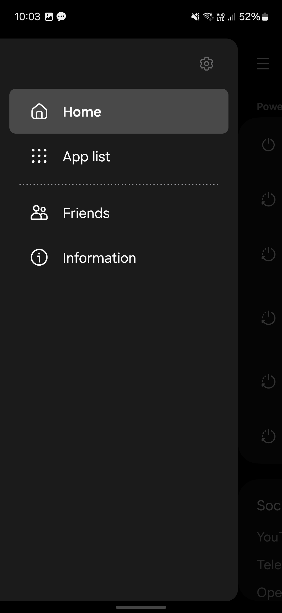
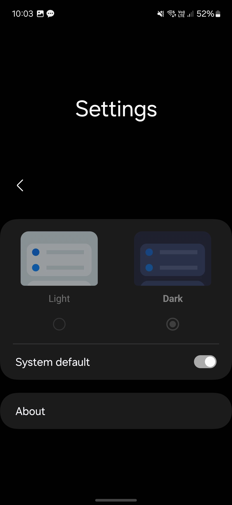

# OST Tools
The program was created to quickly reboot the phone into different modes, for example: fastbootd, fastboot, download mode and a bunch of different modes. Also, using ROOT rights, you can view all system applications and can also remove them.

## Program translators and who participated in the development
- [zhh4eny](https://t.me/zh4eny) - Created a MD file. 
- [Radomyr](https://github.com/BRamil0) - For help to translate application to Ukrainian.
- [Anton](https://github.com/Anton-Aboba1234) - For help to translate application to Ukrainian
- [Bohdan](https://github.com/bohdan157) - For help to translate application to Ukrainian

## Credites
- [Tribalfs](https://github.com/tribalfs/oneui-design)
- [Google](https://developer.android.com/jetpack) for their Jetpack and Material Components libraries.
- [Samsung](https://www.samsung.com/) for their awesome OneUI Design.
- [Yanndroid](https://github.com/Yanndroid) and [Salvo Giangreco](https://github.com/salvogiangri) who created the [OneUI4 Design library](https://github.com/OneUIProject/oneui-design) where this repository came from.

## Libs
- [libsu](https://github.com/topjohnwu/libsu) - for SU permission (by [topjohnwu](https://github.com/topjohnwu))
- [OneUI Design](https://github.com/tribalfs/oneui-design)
